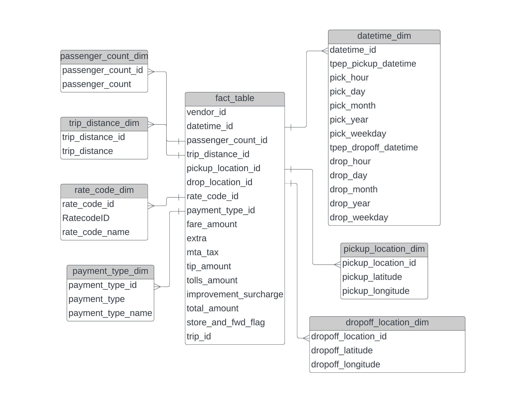

# 🚖 Uber Trip Data Analytics on Google Cloud Platform

<p align="center">
  
  
  
  
  
  
</p>

<p align="center">
  <strong>End-to-End Data Engineering Project using Google Cloud Platform, Mage, BigQuery, and Looker Studio for processing and analyzing NYC Taxi Trip Data.</strong>
</p>

---

## 📖 Project Overview

This project demonstrates the implementation of a complete cloud-native data engineering pipeline on Google Cloud Platform (GCP).

The pipeline extracts raw NYC Taxi & Limousine Commission (TLC) trip data, performs transformations using Mage, stores curated datasets in BigQuery, and generates business insights through Looker Studio dashboards.

The project was developed to gain hands-on experience with:

- Cloud Data Engineering
- ETL Pipeline Development
- Data Warehousing
- Data Modeling
- Analytics Engineering
- Dashboard Development

---

## 🎯 Business Problem

The NYC Taxi & Limousine Commission (TLC) publishes millions of taxi trip records containing detailed transportation information.

These records include:

- Pickup & Dropoff timestamps
- Passenger counts
- Trip distances
- Fare details
- Payment methods
- Pickup and Dropoff locations

Raw transportation data is difficult to analyze directly.

This project transforms raw trip records into an analytics-ready data warehouse that supports business intelligence and operational reporting.

---

## 📊 Dataset

The project uses publicly available TLC Taxi Trip Record Data.

### Dataset Features

✅ Pickup & Dropoff DateTime

✅ Passenger Count

✅ Trip Distance

✅ Fare Amount

✅ Payment Type

✅ Vendor Information

✅ Location IDs

### Data Source

https://www.nyc.gov/site/tlc/about/tlc-trip-record-data.page

### Data Dictionary

See:

```text
data_dictionary_trip_records_yellow.pdf
```

included in this repository.

---

# 🏗️ Architecture

The pipeline follows a modern cloud data engineering architecture.


### Workflow

```text
Raw TLC Dataset
        │
        ▼
Google Cloud Storage
        │
        ▼
Mage ETL Pipeline
        │
        ▼
BigQuery Data Warehouse
        │
        ▼
Looker Studio Dashboard
```

---

# 🧩 Data Model

A dimensional data model was designed to support efficient analytics and reporting.



The model consists of:

### Fact Table

- Trip Fact

### Dimension Tables

- Datetime Dimension
- Passenger Count Dimension
- Rate Code Dimension
- Payment Type Dimension
- Pickup Location Dimension
- Dropoff Location Dimension

This structure improves query performance and enables scalable reporting.

---

# ⚙️ Technology Stack

## Programming

- Python
- SQL

## Cloud Platform

- Google Cloud Platform (GCP)

## Services Used

### ☁️ Google Cloud Storage

Used as the Data Lake for storing raw taxi trip datasets.

### 💻 Google Compute Engine

Used to host Mage and execute ETL workloads.

### 🔄 Mage

Used for:

- Data Extraction
- Data Transformation
- Pipeline Orchestration
- Workflow Automation

### 📊 BigQuery

Used as the enterprise-scale cloud data warehouse.

### 📈 Looker Studio

Used for dashboarding and business intelligence.

---

# 📂 Repository Structure

```text
Uber-Trip-Data-GCP/
│
├── data/
│   └── Source datasets
│
├── mage-files/
│   └── Mage ETL pipelines
│
├── Uber-Data-Analytics.ipynb
│
├── analytics_query.sql
│
├── commands.txt
│
├── GCP_diagram.jpg
│
├── Data_model_diagram.jpeg
│
├── Uber_Dashboard.pdf
│
├── data_dictionary_trip_records_yellow.pdf
│
└── README.md
```

---

# 🔄 ETL Pipeline

## Step 1: Data Ingestion

Raw TLC trip records are uploaded into Google Cloud Storage.

### Source Layer

```text
GCS Bucket
```

stores raw CSV datasets.

---

## Step 2: Data Transformation

Mage extracts data from Cloud Storage and performs:

- Data Cleaning
- Type Conversion
- Null Handling
- Feature Engineering
- Schema Standardization

Pipeline code can be found in:

```text
mage-files/
```

---

## Step 3: Data Warehouse Loading

The transformed datasets are loaded into:

```text
Google BigQuery
```

for analytical processing.

---

## Step 4: Analytics Layer

Business metrics and KPIs are generated using SQL.

Query file:

```text
analytics_query.sql
```

---

## Step 5: Dashboarding

Looker Studio connects directly to BigQuery and visualizes:

- Revenue Trends
- Trip Distribution
- Passenger Analysis
- Payment Method Analysis
- Distance Metrics

---

# 📈 Dashboard

The final dashboard was created using Looker Studio.

Dashboard export:

```text
Uber_Dashboard.pdf
```

### Dashboard Insights

- Total Trips
- Revenue Trends
- Passenger Behavior
- Payment Method Distribution
- Distance Analysis
- Time-Based Trip Patterns

---

# 📓 Analytics Notebook

Additional exploratory analysis and validation were performed in:

```text
Uber-Data-Analytics.ipynb
```

This notebook includes:

- Data Exploration
- Statistical Analysis
- Data Validation
- Visualization

---

# 🚀 Setup Instructions

## Clone Repository

```bash
git clone https://github.com/SDeBAS/Uber-Trip-Data-GCP.git
```

## Navigate to Repository

```bash
cd Uber-Trip-Data-GCP
```

## Install Mage

```bash
pip install mage-ai
```

## Configure GCP

1. Create GCS Bucket
2. Upload Dataset
3. Create BigQuery Dataset
4. Configure Service Account
5. Update Mage Configuration

---

# 🎓 Key Learnings

This project helped develop practical skills in:

- Data Engineering
- Cloud Computing
- ETL Development
- Data Modeling
- BigQuery
- SQL Optimization
- Workflow Orchestration
- Dashboard Development
- Google Cloud Platform

---

# 🔮 Future Enhancements

- Apache Airflow Integration
- Real-Time Streaming Pipelines
- Data Quality Framework
- Terraform Deployment
- CI/CD Automation
- Incremental Data Processing
- BigQuery Partitioning
- Machine Learning Integration

---

# 👨‍💻 Author

## Debanjan Basu

**Data Engineer | BI Developer | Cloud & Analytics Enthusiast**

GitHub: https://github.com/SDeBAS

---

# ⭐ Support

If you found this project useful, consider giving it a ⭐ on GitHub.
